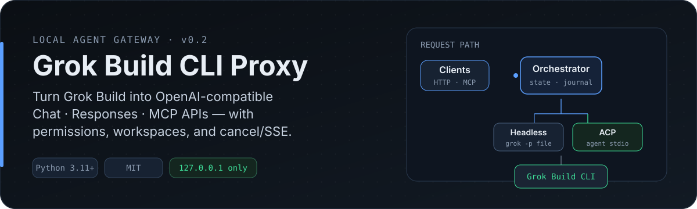
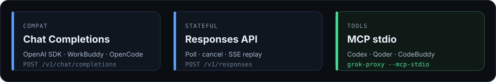
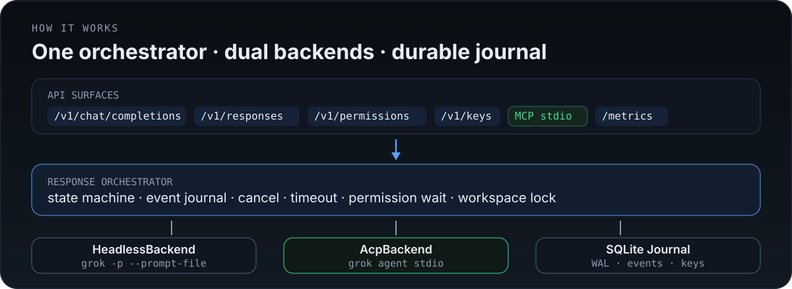

<p align="center">
  
</p>

<p align="center">
  <a href="./README.md">English</a> · <strong>中文</strong>
</p>

<p align="center">
  面向 <a href="https://x.ai">Grok Build CLI</a> 的 <strong>本地 Agent 网关</strong><br/>
  OpenAI Chat Completions · Responses API · 权限 · 工作区 · MCP
</p>

<p align="center">
  <a href="#快速开始">快速开始</a> ·
  <a href="#它是什么">它是什么</a> ·
  <a href="#工作原理">工作原理</a> ·
  <a href="#api-要点">API</a> ·
  <a href="#agent-客户端">客户端</a> ·
  <a href="#安全">安全</a> ·
  <a href="docs/clients/README.md">集成指南</a>
</p>

---

## 快速开始

<p align="center">
  
</p>

**环境要求：** Python **3.11+** · [Grok Build CLI](https://x.ai) 在 `PATH` 上（或设置 `GROK_BIN`）· 已登录（`grok login` 或 `XAI_API_KEY`）

```bash
cd OpenGrokBuild
uv sync --all-extras

# 首次启动会自动生成 API Key（~/.grok-proxy/）
uv run grok-proxy

# 可选：向客户端配置写入模型（仅 upsert，不会清空原有模型）
uv run grok-proxy --install-workbuddy
uv run grok-proxy --install-opencode
uv run grok-proxy --install-pi-agent
# 可合并：
# uv run grok-proxy --install-workbuddy --install-opencode --install-pi-agent
```

启动时会打印 **Base URL / API Key / Model ID**，并写入：

| 文件 | 用途 |
|------|------|
| `~/.grok-proxy/api_key` | Bearer token |
| `~/.grok-proxy/client-config.json` | OpenAI 兼容客户端字段 |
| `~/.grok-proxy/workbuddy-model.json` | WorkBuddy 模型条目 |

安装参数写入位置：

| 参数 | 目标 | 行为 |
|------|------|------|
| `--install-workbuddy` | `~/.workbuddy/models.json` | 插入/更新 Custom 模型，保留其它项 |
| `--install-opencode` | `~/.config/opencode/opencode.json` | 插入/更新 `provider.grok-proxy` 与模型，保留其它 provider/模型 |
| `--install-pi-agent` | `~/.pi/agent/models.json` | 插入/更新 `providers.grok-proxy` 与模型，保留其它 provider/模型 |

### 第一次请求

```bash
export KEY="$(cat ~/.grok-proxy/api_key)"

curl -s http://127.0.0.1:8787/v1/responses \
  -H "Authorization: Bearer $KEY" \
  -H "Content-Type: application/json" \
  -d '{
    "input": "Summarize this repository in 5 bullets",
    "x_grok": {"cwd": "'"$PWD"'", "workspace_mode": "read_only"}
  }' | jq .
```

<details>
<summary><strong>Chat Completions</strong>（WorkBuddy / OpenAI SDK）</summary>

```bash
curl -s http://127.0.0.1:8787/v1/chat/completions \
  -H "Authorization: Bearer $KEY" \
  -H "Content-Type: application/json" \
  -d '{
    "model": "grok-4.5",
    "messages": [{"role":"user","content":"List top-level files."}],
    "cwd": "'"$PWD"'",
    "stream": false
  }' | jq .
```

```python
from openai import OpenAI
import json
from pathlib import Path

cfg = json.loads(Path.home().joinpath(".grok-proxy/client-config.json").read_text())
client = OpenAI(base_url=cfg["base_url"], api_key=cfg["api_key"])
r = client.chat.completions.create(
    model=cfg["model"],
    messages=[{"role": "user", "content": "Fix the failing unit tests."}],
    extra_body={"cwd": "/path/to/repo", "max_turns": 30},
)
print(r.choices[0].message.content)
```

</details>

---

## 它是什么

其他 Agent / IDE 讲 **OpenAI HTTP** 或 **MCP**；Grok Build 讲 **CLI / ACP**。

本项目是中间那一层：单个本地进程，把 Grok 变成 **有状态的 Agent 网关**——而不是一次性的 chat completion 包装。

<p align="center">
  
</p>

| 你调用 | 网关做什么 | Grok 如何跑 |
|--------|------------|-------------|
| `POST /v1/chat/completions` | 编排 + stream/JSON | Headless 或 ACP |
| `POST /v1/responses` | 创建 / 轮询 / 取消 / SSE 回放 | 同上 |
| MCP tools | `grok_consult` / `review` / `delegate` … | 同上 |

**v0.2** 继续兼容 WorkBuddy / OpenAI SDK，并增加 Responses 生命周期、作用域密钥、权限审批与 ACP（`grok agent stdio`）。

### 为什么不只用 `grok -p`？

| 需求 | 仅 Headless | 本网关 |
|------|-------------|--------|
| OpenAI SDK / WorkBuddy | 手写胶水 | ✅ |
| 长任务：轮询 / 取消 / SSE 重连 | ❌ | ✅ `/v1/responses` |
| 人工审批且禁止自批准 | 难 | ✅ 作用域密钥 + 权限 API |
| 工作区隔离（worktree） | 临时方案 | ✅ 模式 + 锁 |
| 通过 MCP 给其他 Agent 用 | ❌ | ✅ `--mcp-stdio` |
| Prompt 不出现在进程 argv | 常暴露 | ✅ `--prompt-file` |

---

## 工作原理

<p align="center">
  
</p>

- **Orchestrator**：响应状态机、事件日志、取消、超时、权限等待。
- **HeadlessBackend**（默认）：`grok -p --prompt-file`（prompt 不进 argv）。
- **AcpBackend**：`grok agent stdio`，带协议握手（已在 CLI 0.2.x 验证）。
- **`auto`**：先试 ACP，失败回退 Headless。
- **SQLite WAL**：`~/.grok-proxy/gateway.db`，持久化事件与密钥。

```bash
export GROK_PROXY_BACKEND=acp   # 或：auto | headless
uv run grok-proxy

# 握手冒烟（不跑长任务）
uv run python scripts/probe_acp.py
```

详见 [docs/ACP.md](docs/ACP.md)。

---

## API 要点

| Method | Path | Auth | 作用 |
|--------|------|------|------|
| GET | `/health` | 否 | 存活探测 |
| GET | `/ready` | 否 | DB + 二进制就绪 |
| GET | `/metrics` | 否 | Prometheus 文本 |
| GET | `/v1/models` | 是 | 模型列表 |
| GET | `/v1/connection` | 是（仅 master key） | 客户端配置快照 |
| POST | `/v1/chat/completions` | 是 | Coding agent（兼容层） |
| POST | `/v1/responses` | 是 | 创建任务 |
| GET | `/v1/responses/{id}` | 是 | 状态 / 输出 |
| POST | `/v1/responses/{id}/cancel` | 是 | 取消 |
| GET | `/v1/responses/{id}/events` | 是 | SSE + `Last-Event-ID` |
| GET/POST | `/v1/permissions/{id}` | 是 | 查看 / 决策 |
| GET/POST | `/v1/keys` | `admin:keys` | 作用域 API Key |

<details>
<summary><strong>后台 Agent 任务</strong></summary>

```json
{
  "input": "Fix failing tests",
  "background": true,
  "x_grok": {
    "cwd": "/path/to/repo",
    "workspace_mode": "worktree",
    "permission_policy": "ask"
  }
}
```

随后轮询 `GET /v1/responses/{id}`，或流式读取 `GET /v1/responses/{id}/events`。

</details>

<details>
<summary><strong>作用域密钥</strong>（禁止自批准）</summary>

Master key（`GROK_PROXY_API_KEY`）拥有全部 scope。可创建委托给 Agent 的子密钥：

```bash
curl -s http://127.0.0.1:8787/v1/keys \
  -H "Authorization: Bearer $MASTER" \
  -H "Content-Type: application/json" \
  -d '{
    "name": "codex-local",
    "workspace_allowlist": ["/Users/me/projects"],
    "max_concurrent": 1,
    "max_runtime_sec": 1800,
    "test": true
  }'
```

默认 Agent scope **不包含** `permission:approve`，因此工具不能自己批准高风险操作。

</details>

<details>
<summary><strong>Chat 扩展字段</strong>（<code>x_grok</code>）</summary>

支持顶层字段与嵌套 `x_grok`；冲突时 **`x_grok` 优先**。

| 字段 | 映射到 |
|------|--------|
| `cwd` / `working_directory` | 工作区 |
| `session_id` | Grok 会话恢复 |
| `max_turns` / `sandbox` / `worktree` | CLI 标志 |
| `always_approve` / `yolo` | 自动批准 |
| `timeout_sec` | 网关杀进程超时 |
| `x_grok.workspace_mode` | `read_only` · `worktree` · `in_place` |

响应包含 `grok.response_id` 与 `grok.session_id`，便于多轮恢复。

</details>

<details>
<summary><strong>MCP 工具</strong></summary>

```bash
uv run grok-proxy --mcp-stdio
```

工具：`grok_consult`、`grok_review`、`grok_delegate`、`grok_status`、`grok_cancel`、`grok_get_diff`、`grok_resume`。

</details>

---

## Agent 客户端

两种集成模式，按客户端选择：

1. **OpenAI 兼容 HTTP** — 客户端把网关当作 chat-completions 提供方（`http://127.0.0.1:8787/v1`）。需要先 `uv run grok-proxy`。
2. **MCP stdio** — 客户端拉起 `grok-proxy --mcp-stdio` 并调用工具。无需预先启动 HTTP 服务；共用同一 SQLite 日志。

| 客户端 | 模式 | 配置位置 |
|--------|------|----------|
| [WorkBuddy](#workbuddy) | HTTP 模型 | `~/.workbuddy/models.json`（可自动安装） |
| [Qoder](#qoder) | MCP stdio | Qoder 设置 → MCP |
| [Codex](#codex) | MCP stdio **或** HTTP 模型 | `~/.codex/config.toml` |
| [OpenCode](#opencode) | HTTP 模型 | `~/.config/opencode/opencode.json`（`--install-opencode`） |
| [Pi Agent](#pi-agent) | HTTP 模型 | `~/.pi/agent/models.json`（`--install-pi-agent`） |
| [Trae CN](#trae-cn) | HTTP 模型（+ MCP） | 设置 → 模型 → 添加模型 |
| CodeBuddy | MCP stdio | 与 Qoder 相同形态 |

```bash
# HTTP 模式
uv run grok-proxy
export GROK_PROXY_API_KEY="$(cat ~/.grok-proxy/api_key)"

# MCP 命令（优先使用绝对路径的 venv 二进制）
/absolute/path/to/OpenGrokBuild/.venv/bin/grok-proxy --mcp-stdio
```

> **HTTP 模式提示：** `/v1/chat/completions` 跑的是 *coding agent*。客户端无法传 `cwd` 时，网关使用 `GROK_PROXY_DEFAULT_CWD`（或启动代理时的当前目录）。请把客户端请求超时调大——Agent 运行是分钟级，不是秒级。

<details>
<summary><strong>WorkBuddy</strong></summary>

```bash
uv run grok-proxy --install-workbuddy   # 写入 ~/.workbuddy/models.json 并启动网关
```

会写入带 **图片输入**、**推理** 和 **上下文窗口** 的 Custom 模型项（数据来自 Grok models cache，例如 `grok-4.5` 的 `maxInputTokens: 500000`）。详见 `~/.grok-proxy/workbuddy-model.json`。

或从该文件手动添加自定义模型：
**url** = `http://127.0.0.1:8787/v1`，**apiKey** = `~/.grok-proxy/api_key` 内容，
**id** = `grok-4.5`（来自 `grok models` 的真实 id，不是旧别名 `grok-build`）。
完成后重启 / 刷新 WorkBuddy 模型列表。

</details>

<details>
<summary><strong>Qoder</strong></summary>

设置 → MCP → 添加服务器（stdio）：

```json
{
  "mcpServers": {
    "grok": {
      "command": "/absolute/path/to/OpenGrokBuild/.venv/bin/grok-proxy",
      "args": ["--mcp-stdio"]
    }
  }
}
```

Qoder 会列出 7 个工具。`grok_consult` / `grok_review` 为只读；`grok_delegate` 默认在隔离 git worktree 中运行，且 `permission_policy=ask`。

</details>

<details>
<summary><strong>Codex</strong></summary>

**方案 A — MCP 服务器**（`~/.codex/config.toml`）：

```toml
[mcp_servers.grok]
command = "/absolute/path/to/OpenGrokBuild/.venv/bin/grok-proxy"
args = ["--mcp-stdio"]
```

**方案 B — 把 Grok 当作 Codex 的模型**（需先启动网关）：

```toml
# ~/.codex/config.toml
model = "grok-4.5"
model_provider = "grok-proxy"

[model_providers.grok-proxy]
name = "grok-proxy"
base_url = "http://127.0.0.1:8787/v1"
env_key = "GROK_PROXY_API_KEY"
wire_api = "chat"
```

</details>

<details>
<summary><strong>OpenCode</strong></summary>

```bash
uv run grok-proxy --install-opencode   # 写入 ~/.config/opencode/opencode.json 并启动网关
```

向**用户级**配置合并 `provider.grok-proxy` 与当前模型 id：其它 provider、同 provider 下其它模型、以及你已选的默认 `model` 都不会被清空。若文件已存在会先写 `.json.bak` 备份。

也可手动编辑项目 `opencode.json` 或用户配置：

```json
{
  "$schema": "https://opencode.ai/config.json",
  "provider": {
    "grok-proxy": {
      "npm": "@ai-sdk/openai-compatible",
      "name": "Grok Proxy (local)",
      "options": {
        "baseURL": "http://127.0.0.1:8787/v1",
        "apiKey": "{env:GROK_PROXY_API_KEY}"
      },
      "models": {
        "grok-4.5": {
          "name": "Grok 4.5 (Grok Build CLI)",
          "limit": { "context": 500000, "output": 65536 },
          "modalities": { "input": ["text", "image"], "output": ["text"] }
        }
      }
    }
  },
  "model": "grok-proxy/grok-4.5"
}
```

`limit` / `modalities` 跟随 Grok models cache（也见 `~/.grok-proxy/client-config.json` → `opencode`）。

网关本身已是完整 Agent，OpenCode 侧用轻量 agent/mode（少本地工具或不用）效果更好——让 Grok 负责编辑。

</details>

<details>
<summary><strong>Pi Agent</strong></summary>

```bash
uv run grok-proxy --install-pi-agent   # 写入 ~/.pi/agent/models.json 并启动网关
```

合并 `providers.grok-proxy` 与当前模型 id；其它 provider 与不同 id 的模型会保留。然后 `/model` → `grok-proxy/grok-4.5`。

`~/.pi/agent/models.json` 形态示例：

```json
{
  "providers": {
    "grok-proxy": {
      "baseUrl": "http://127.0.0.1:8787/v1",
      "api": "openai-completions",
      "apiKey": "sk-gp-…",
      "compat": { "supportsDeveloperRole": false },
      "models": [
        {
          "id": "grok-4.5",
          "name": "Grok 4.5",
          "reasoning": true,
          "input": ["text", "image"],
          "contextWindow": 500000,
          "maxTokens": 65536
        }
      ]
    }
  }
}
```

`supportsDeveloperRole: false` 会让 pi 发送普通 `system` 消息。

</details>

<details>
<summary><strong>Trae CN</strong></summary>

1. 设置 → 模型 → **添加模型** → 选择 **自定义配置**
2. API 格式：**兼容 OpenAI**
3. 请求地址：`http://127.0.0.1:8787/v1`（若要求完整地址则填 `…/v1/chat/completions`）
4. 模型 ID：`grok-4.5`，API Key：`~/.grok-proxy/api_key` 文件内容
5. 保存时 Trae 会发连通性测试 —— 网关和 grok CLI 登录态需可用

Trae 的 MCP 面板同样可以添加 stdio 服务器，命令与 Qoder 一致。

</details>

<details>
<summary><strong>第三方 Agent 安全</strong></summary>

给每个 Agent 单独的 **作用域密钥**，不要用 master key：

```bash
curl -s http://127.0.0.1:8787/v1/keys \
  -H "Authorization: Bearer $(cat ~/.grok-proxy/api_key)" \
  -H "Content-Type: application/json" \
  -d '{"name": "opencode", "workspace_allowlist": ["'"$HOME"'/projects"], "max_concurrent": 1}'
```

用 master key 批准待处理的高风险操作：

```bash
curl -s "http://127.0.0.1:8787/v1/permissions?status=pending" -H "Authorization: Bearer $MASTER"
curl -s -X POST "http://127.0.0.1:8787/v1/permissions/<id>/decision" \
  -H "Authorization: Bearer $MASTER" -H "Content-Type: application/json" \
  -d '{"decision": "allow_once"}'
```

</details>

完整 walkthrough：[docs/clients/README.md](docs/clients/README.md)

---

## 安全

持有 Bearer token 的人，可以在允许的工作区内运行 **本地 coding agent**。

| 默认项 | 值 |
|--------|-----|
| 绑定地址 | 仅 `127.0.0.1` |
| 鉴权 | 需要 Bearer |
| 工作区 | 优先 `read_only`；`in_place` 关闭 |
| Prompt | `--prompt-file`，权限 `0600` |
| 密钥 | 作用域密钥仅存哈希 |
| Agent scope | 默认禁止自批准 |

**不要**在没有额外防护的情况下把服务暴露到公网。完整说明见 [docs/SECURITY.md](docs/SECURITY.md)。

---

## 配置

| 变量 | 默认 | 含义 |
|------|------|------|
| `GROK_PROXY_API_KEY` | 自动生成 | Master Bearer token |
| `GROK_PROXY_HOST` / `PORT` | `127.0.0.1` / `8787` | 绑定地址 |
| `GROK_BIN` | `grok` | CLI 路径 |
| `GROK_PROXY_BACKEND` | `headless` | `headless` · `acp` · `auto` |
| `GROK_PROXY_DATABASE_PATH` | `~/.grok-proxy/gateway.db` | SQLite |
| `GROK_PROXY_CWD_ALLOWLIST` | 空 | 允许的工作区前缀 |
| `GROK_PROXY_MAX_CONCURRENT` | `10` | 全局并行数 |
| `GROK_PROXY_DEFAULT_TIMEOUT_SEC` | `600` | 单请求超时 |
| `GROK_PROXY_DEFAULT_WORKSPACE_MODE` | `read_only` | 默认工作区模式 |
| `GROK_PROXY_ALLOW_IN_PLACE` | `false` | 是否允许修改源目录 |
| `GROK_PROXY_PERMISSION_TIMEOUT_SEC` | `900` | 待审批超时 |

---

## 开发

```bash
uv sync --all-extras
uv run pytest -q -m "not grok_e2e"
# 可选真实 ACP：
# RUN_GROK_E2E=1 uv run pytest -m grok_e2e -q
```

```bash
./scripts/e2e_all.sh                 # MCP + ACP + 单元测试（代理在跑时含 HTTP）
./scripts/e2e_http.sh                # 需要：uv run grok-proxy
E2E_LIVE_PROMPT=1 ./scripts/e2e_http.sh
./scripts/e2e_mcp.sh
./scripts/e2e_acp.sh
```

---

## 文档

| 文档 | 主题 |
|------|------|
| [docs/ARCHITECTURE.md](docs/ARCHITECTURE.md) | 模块地图 |
| [docs/ADR-001-acp-runtime-responses-api.md](docs/ADR-001-acp-runtime-responses-api.md) | 为何选方案 B |
| [docs/ACP.md](docs/ACP.md) | ACP 协议说明 |
| [docs/API-CONTRACT-SNAPSHOT.md](docs/API-CONTRACT-SNAPSHOT.md) | API 契约 |
| [docs/UPGRADE-0.2.md](docs/UPGRADE-0.2.md) | v0.1 → v0.2 |
| [docs/RELEASE-NOTES-0.2.md](docs/RELEASE-NOTES-0.2.md) | 发布说明 |
| [docs/SECURITY.md](docs/SECURITY.md) | 安全模型 |
| [docs/COMPAT-MATRIX.md](docs/COMPAT-MATRIX.md) | 兼容性 |
| [docs/clients/README.md](docs/clients/README.md) | 各客户端指南 |
| [CHANGELOG.md](CHANGELOG.md) | 变更日志 |

---

## 非目标

- 多租户公有 SaaS / 计费
- 完整云容器编排
- 用 OpenAI 专有协议替换全部 Grok 内部事件

---

## 许可证

[MIT](LICENSE)
